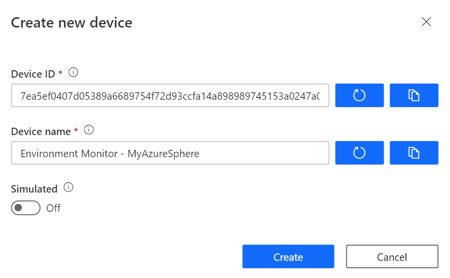

# Integrate Azure Sphere with Azure IoT Central


Follow me on Twitter [@dglover](https://twitter.com/dglover)

|Author|[Dave Glover](https://developer.microsoft.com/en-us/advocates/dave-glover?WT.mc_id=github-blog-dglover), Microsoft Cloud Developer Advocate |
|:----|:---|
|Target Platform | Seeed Studio Azure Sphere MT3620 |
|Target Service | [Azure IoT Central](https://azure.microsoft.com/services/iot-central/?WT.mc_id=github-blog-dglover) |
|Developer Platform | Windows 10 or Ubuntu 18.04 |
|Azure SDK | Azure Sphere SDK 19.11 or better |
|Developer Tools| [Visual Studio (The free Community Edition or better)](https://visualstudio.microsoft.com/vs/?WT.mc_id=github-blog-dglover) or [Visual Studio Code (Free OSS)](https://code.visualstudio.com?WT.mc_id=github-blog-dglover)|
|Hardware | [Seeed Studio Grove Shield](https://www.seeedstudio.com/MT3620-Grove-Shield.html), and the [Grove Temperature and Humidity Sensor (SHT31)](https://www.seeedstudio.com/Grove-Temperature-Humidity-Sensor-SHT31.html) |
|Source Code | https://github.com/gloveboxes/Create-a-Secure-IoT-Solution-with-Azphere-Sphere-and-and-Azure-IoT-Central|
|Language| C|
|Date|As of January, 2020|

## Introduction to Azure Sphere Development

## What you will learn

You will learn how to build an [Azure Sphere](https://azure.microsoft.com/services/azure-sphere/?WT.mc_id=github-blog-dglover) application that integrates with [Azure IoT Central](https://azure.microsoft.com/services/iot-central/?WT.mc_id=github-blog-dglover). This includes support for displaying telemetry, controlling the device state using IoT Central *Settings* ([Azure IoT Hub Device Twins](https://docs.microsoft.com/en-us/azure/iot-hub/iot-hub-devguide-device-twins?WT.mc_id=github-blog-dglover)) and *Commands* ([Azure IoT Hub Direct Methods](https://docs.microsoft.com/en-us/azure/iot-hub/iot-hub-devguide-direct-methods?WT.mc_id=github-blog-dglover)), defining rules to trigger workflows, and a custom dashboard.

If unfamiliar with Azure Sphere development then review the [Create a Secure Azure Sphere App using the Grove Shield Sensor Kit](https://github.com/gloveboxes/Create-a-Secure-Azure-Sphere-App-using-the-Grove-Shield-Sensor-Kit) tutorial before starting this tutorial.

## What is Azure Sphere

Azure Sphere is a secured, high-level application platform with built-in communication and security features for internet-connected devices.

It comprises a secured, connected, crossover microcontroller unit (MCU), a custom high-level Linux-based operating system (OS), and a cloud-based security service that provides continuous, renewable security.


## Why Azure Sphere

As billions of new devices are connected, organizations need to secure them to help protect data, privacy, physical safety, and infrastructure. Azure Sphere builds on decades of Microsoft experience in hardware, software, and cloud to provide a turnkey solution for IoT devices. Get defense in depth to embrace IoT innovation with confidence.

### What is Azure IoT Central

Azure IoT Central provides an easy way to connect, monitor and manage your Internet of Things (IoT) assets at scale. [Azure IoT Central](https://azure.microsoft.com/en-in/services/iot-central/?WT.mc_id=github-blog-dglover) is a hosted, extensible software as a service (SaaS) platform that simplifies the setup of your IoT solution and helps reduce the burden and costs of IoT management, operations, and development. Provide customers superior products and services while expanding your business possibilities.


## Tutorial Overview

1. Create an Azure IoT Central Application (Free trial)
2. Set up Azure IoT Central to work with Azure Sphere
3. Deploy an Azure IoT Central application to Azure Sphere

## Clone the following GitHub Repositories

1. The Azure Sphere Samples

   ```bash
   git clone https://github.com/Azure/azure-sphere-samples.git
   ```

2. This tutorial

    ```bash
    git clone https://github.com/gloveboxes/Create-a-Secure-IoT-Solution-with-Azphere-Sphere-and-and-Azure-IoT-Central.git
    ```

## Create an Azure IoT Central Application


We are going to create an Azure IoT Central application, connect Azure IoT Central to an Azure Sphere Tenant, and finally create a device.

1. Open the [Azure IoT Central](https://azure.microsoft.com/en-au/services/iot-central/?WT.mc_id=github-blog-dglover) in a new browser tab, then click **Getting started**.

2. Next, you will need to sign with your **Microsoft** Personal, or Work, or School account. If you do not have a Microsoft account, then you can create one for free using the **Create one!** link.

    

3. Create a new Azure IoT Central application. Scroll to the bottom of the screen, select **Create a custom app**. This takes you to the **Create Application** page.

<!-- 4. Select **Build as app**

    

5. Select **Custom app**

     -->

### Create a **New application**

Specify **Application name**, **URL**, enable **7 day free trial**, and complete the registration form. Then click **Create**.


1. Add new Device Template

    Click **Device templates**

    

2. Select **IoT device** template type

    

3. Create an **IoT Device** Template

    1. Select **IoT device**,
    2. Click **Next:Customise**,
    3. Click **Next: Review**,
    4. Click **Create**.
    5. Name your template, and press **Enter**

### Create a Capability Model

#### Add an Interface

1. Click **Custom**,

2. Click the **+ Add interface** to add an **Interface**.

3. Choose **Custom** interface.
<!--  -->

#### Add Capabilities


Click **<** (Collapse) to create more working space.

1. Add **Humidity** Capability
    1. Click **+** to Add capability.
    2. Add **Humidity** Telemetry Capability
    3. Set the Unit to **%**

    

2. Click **Add Capability** and add **Temperature** Capabilities

    * Display name: Temperature
    * Name: Temperature
    * Semantic type: Temperature
    * Units: C
    * Display Unit: C

3. Click **Save** to save the capabilities model.

    

#### Create a Device Template View

1. Click **Views**
2. Click **Generate default views**
3. Click **Generate default dashboard view(s)**
4. You can customize the default view later.

    

#### Publish the Template

Click **Publish** to activate the template, then click **Publish**.


## Connect Azure IoT Central to an Azure Azure Sphere Tenant

The Azure Sphere includes out of the box support for Azure IoT Hub and IoT Central.

Follow the complete [Set up Azure IoT Central to work with Azure Sphere](https://docs.microsoft.com/en-us/azure-sphere/app-development/setup-iot-central?WT.mc_id=github-blog-dglover) guide.

In summary, you need to:

1. Open an Azure Sphere Developer Command Prompt
2. Authenticate ``` azsphere login ```
3. Download the Certificate Authority (CA) certificate for your Azure Sphere tenant ``` azsphere tenant download-CA-certificate --output CAcertificate.cer ```
4. Upload the tenant CA certificate to Azure IoT Central and generate a verification code
5. Verify the tenant CA certificate
6. Use the validation certificate to verify the tenant identity

### Create an Azure Device in Azure IoT Central

From the Azure Sphere Developer Command Prompt, type the following command.

```bash
azsphere device show-attached
```

Note: The Create New Device dialog box in Azure IoT Central requires that the device ID be in lowercase characters. From the Azure Sphere Developer Command Prompt, enter the following command, which gets the ID of the attached device and converts it to lowercase:

```bash
powershell -Command ((azsphere device show-attached)[0] -split ': ')[1].ToLower()
```

#### Switch back to Azure IoT Central Web Portal

1. Select Devices from the side menu, then the Device Template previously created.


2. Click **+ New** to add a new device

    Paste in the **device ID** you generated with the PowerShell command into the **Device ID** field and give your device a friendly name.



3. Click **Create** to create the new device.

## Configure the Azure Sphere Application for Azure IoT Central

Review the [Azure IoT Central Sample ](https://github.com/Azure/azure-sphere-samples/blob/master/Samples/AzureIoT/IoTCentral.md) guide.

### Config the Azure Sphere Application

1. Open the *Create-a-Secure-IoT-Solution-with-Azphere-Sphere-and-and-Azure-IoT-Central* solution you cloned with Visual Studio
2. Open the app_manifest.json file
3. Set the default Azure Sphere Tenant
    You may need to select the default Azure Sphere Tenant. Use the ```azsphere tenant list``` command to list available tenants, use the ```azsphere tenant select -i <guid>``` to select the default tenant.
4. From the Azure Sphere Developer Command Prompt, issue the following command to get the tenant ID. Copy the returned value and paste it into the DeviceAuthentication field of the app_manifest.json file:

    ```bash
    azsphere tenant show-selected
    ```

5. From the Azure Sphere Developer Command Prompt, change to the *azure-sphere-samples\Samples\AzureIoT\Tools* folder you previously cloned, and run *ShowIoTCentralConfig.exe*.

    ```bash
    ShowIoTCentralConfig
    ```

    When prompted, log in with the credentials you use for Azure IoT Central.

    The output of this command will be similar as follows:

    ```
    Are you using a Work/School account to sign in to your IoT Central Application (Y/N) ?

    Getting your IoT Central applications
    You have one IoT Central application 'yourappname-iot-central'.
    Getting the Device Provisioning Service (DPS) information.
    Getting a list of IoT Central devices.

    Find and modify the following lines in your app_manifest.json:
    "CmdArgs": [ "0ne9992KK6D" ],
    "AllowedConnections": [ "global.azure-devices-provisioning.net", "saas-iothub-9999999-f33a-4002-4444-7ca8989898989.azure-devices.net" ],
    "DeviceAuthentication": "--- YOUR AZURE SPHERE TENANT ID--- ",
    ```
7. 	Copy the information from the output into the app_manifest.json file in Visual Studio. You *app_manifest.json* file will look similar to the following:

    ```json
    {
    "SchemaVersion": 1,
    "Name": "AzureSphereBlink1",
    "ComponentId": "a3ca0929-5f46-42b0-91ba-d5de1222da86",
    "EntryPoint": "/bin/app",
    "CmdArgs": [ "0ne9992KK6D" ],
    "Capabilities": {
        "Gpio": [ 9 ],
        "Uart": [ "ISU0" ],
        "AllowedConnections": [ "global.azure-devices-provisioning.net", "saas-iothub-9999999-f33a-4002-4444-7ca8989898989.azure-devices.net" ],
        "DeviceAuthentication": "999x999xeb-e021-43ce-8gh8-8k9lp888494"
    },
    "ApplicationType": "Default"
    }
    ```

### Configure Visual Studio App Deployment Settings

Before building the application with Visual Studio ensure ARM-Debug and GDB Debugger (HLCore) options are selected.


### Build, Deploy, and start Debugging

To start the build, deploy, debug process either click the Visual Studio **Start Selected Item** icon or press **F5**. To Build and deploy without attaching the debugger, simply press **Ctrl+F5**.


## Azure IoT Central Integration

Now the application is running on the Azure Sphere switch across to Azure IoT Central, select the **Devices** tab, the device template you created, then the actual device. You may have to wait a moment before the telemetry is displayed in the **Measurements** panel.


### Azure IoT Central Settings

To work with settings you will need to update the Device Template and add settings for **Light** and **Relay**. See the Appendix.

Switch to the settings tab on Azure IoT Central and change the toggle state and click update and observe an LED on the Azure Sphere will toggle between on and off.


## Finished 完了 fertig finito ख़त्म होना terminado

Congratulations you have finished the tutorial.


## Appendix

### Understanding Tutorial Solution

From Visual Studio, open the main.c.

Review the following functions.

1. InitPeripheralsAndHandlers
2. GetTelemetry
3. TwinCallback
4. AzureDirectMethodHandler

#### InitPeripheralsAndHandlers

Sets up SIGTERM termination handler, initialize peripherals, and set up event handlers.

```c
static int InitPeripheralsAndHandlers(void)
{
    struct sigaction action;
    memset(&action, 0, sizeof(struct sigaction));
    action.sa_handler = TerminationHandler;
    sigaction(SIGTERM, &action, NULL);

    epollFd = CreateEpollFd();
    if (epollFd < 0) {
        return -1;
    }

    OpenPeripheral(&sending);
    OpenPeripheral(&relay);
    OpenPeripheral(&light);

    // Initialize Grove Shield and Grove Temperature and Humidity Sensor
    GroveShield_Initialize(&i2cFd, 115200);
    sht31 = GroveTempHumiSHT31_Open(i2cFd);

    StartTimer(&iotClientDoWork);
    StartTimer(&iotClientMeasureSensor);

    return 0;
}
```

#### GetTelemetry

Reads sensor telemetry and returns the data as a JSON object.

```c
static int ReadTelemetry(char eventBuffer[], size_t len) {
    GroveTempHumiSHT31_Read(sht31);
    float temperature = GroveTempHumiSHT31_GetTemperature(sht31);
    float humidity = GroveTempHumiSHT31_GetHumidity(sht31);

    static const char* EventMsgTemplate = "{ \"Temperature\": \"%3.2f\", \"Humidity\": \"%3.1f\", \"MsgId\":%d }";
    return snprintf(eventBuffer, len, EventMsgTemplate, temperature, humidity, msgId++);
}
```

#### TwinCallback

Handles [Azure IoT Hub Device Twins](https://docs.microsoft.com/en-us/azure/iot-hub/iot-hub-devguide-device-twins?WT.mc_id=github-blog-dglover).

In Azure IoT Central, Azure IoT Hub Device Twins are exposed in the user interface as *Settings*.


```c
static void TwinCallback(DEVICE_TWIN_UPDATE_STATE updateState, const unsigned char* payload,
    size_t payloadSize, void* userContextCallback)
{
    JSON_Value* root_value = NULL;
    JSON_Object* root_object = NULL;

    char* payLoadString = (char*)malloc(payloadSize + 1);
    if (payLoadString == NULL) {
        goto cleanup;
    }

    memcpy(payLoadString, payload, payloadSize);
    payLoadString[payloadSize] = 0; //null terminate string

    root_value = json_parse_string(payLoadString);
    if (root_value == NULL) {
        goto cleanup;
    }

    root_object = json_value_get_object(root_value);
    if (root_object == NULL) {
        goto cleanup;
    }


    JSON_Object* desiredProperties = json_object_dotget_object(root_object, "desired");
    if (desiredProperties == NULL) {
        desiredProperties = root_object;
    }

    SetDesiredState(desiredProperties, &relay);
    SetDesiredState(desiredProperties, &light);

cleanup:
    // Release the allocated memory.
    if (root_value != NULL) {
        json_value_free(root_value);
    }
    free(payLoadString);
}
```

#### AzureDirectMethodHandler

Handles [Azure IoT Hub Direct Methods](https://docs.microsoft.com/en-us/azure/iot-hub/iot-hub-devguide-direct-methods?WT.mc_id=github-blog-dglover)

In Azure IoT Central, Azure IoT Hub Direct Methods are exposed in the user interface as *Commands*.


```c
static int AzureDirectMethodHandler(const char* method_name, const unsigned char* payload, size_t payloadSize,
    unsigned char** responsePayload, size_t* responsePayloadSize, void* userContextCallback) {

    const char* onSuccess = "\"Successfully invoke device method\"";
    const char* notFound = "\"No method found\"";

    const char* responseMessage = onSuccess;
    int result = 200;
    JSON_Value* root_value = NULL;
    JSON_Object* root_object = NULL;

    // Prepare the payload for the response. This is a heap allocated null terminated string.
    // The Azure IoT Hub SDK is responsible of freeing it.
    *responsePayload = NULL;  // Response payload content.
    *responsePayloadSize = 0; // Response payload content size.

    char* payLoadString = (char*)malloc(payloadSize + 1);
    if (payLoadString == NULL) {
        responseMessage = "payload memory failed";
        result = 500;
        goto cleanup;
    }

    memcpy(payLoadString, payload, payloadSize);
    payLoadString[payloadSize] = 0; //null terminate string

    root_value = json_parse_string(payLoadString);
    if (root_value == NULL) {
        responseMessage = "Invalid JSON";
        result = 500;
        goto cleanup;
    }

    root_object = json_value_get_object(root_value);
    if (root_object == NULL) {
        responseMessage = "Invalid JSON";
        result = 500;
        goto cleanup;
    }

    if (strcmp(method_name, "fanspeed") == 0)
    {
        int speed = (int)json_object_get_number(root_object, "speed");
        Log_Debug("Set fan speed %d", speed);
    }
    else
    {
        responseMessage = notFound;
        result = 404;
    }

cleanup:

    // Prepare the payload for the response. This is a heap allocated null terminated string.
    // The Azure IoT Hub SDK is responsible of freeing it.
    *responsePayloadSize = strlen(responseMessage);
    *responsePayload = (unsigned char*)malloc(*responsePayloadSize);
    strncpy((char*)(*responsePayload), responseMessage, *responsePayloadSize);

    if (root_value != NULL) {
        json_value_free(root_value);
    }
    free(payLoadString);

    return result;
}
```

### Azure IoT Central Template Settings for Device Twins


